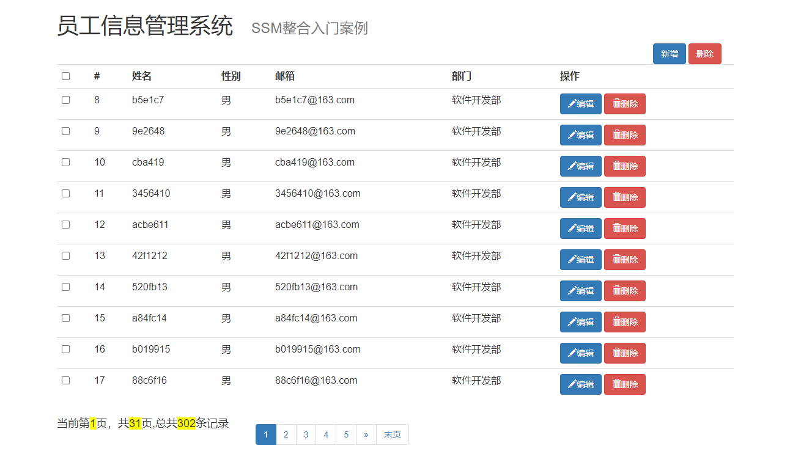
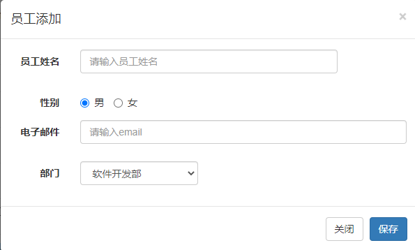
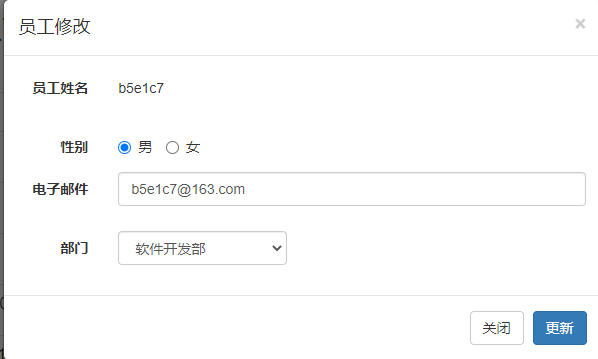
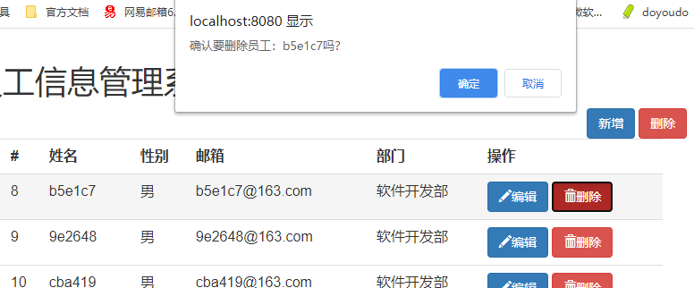

# 整合SSM(一)--建立项目、配置文件

学完了三大框架，来个SSM整合项目巩固知识，学会了就会增删改查了。

简易的员工信息管理系统，功能点包括：

1. 分页展示员工信息
2. 可以对员工信息进行新增、修改、单个删除和批量删除
3. 对输入的信息进行数据校验：JQuery前端校验+JSR303后端校验
4. Rest风格的URI：GET（查询），POST（新增），PUT（修改），DELETE（删除）

基本页面展示：



参考视频：B站 雷丰阳老师 尚硅谷SSM框架实战，ssm整合教程 https://www.bilibili.com/video/BV17W411g7zP

技术点：

- 基础框架-SSM（SpringMVC+Spring+MyBatis）
- 数据库-MySQL
- 前端框架-BootStrap快速搭建简洁美观的界面
- 异步请求-Ajax
- 分页插件-PageHelper
- 逆向工程-MyBatis Generator

本笔记内容包括：

1. 项目搭建，导入相关的依赖
2. 配置文件，包括web.xml，Mybatis，SpringMVC的配置文件整合

## 1. 导入依赖

所需的依赖包括：

- Spring
- SpringMVC
- MyBatis，MyBatis Generator
- 数据库连接池，驱动包
- 其他（JSTL，Servlet-api，Junit）等
- JSR303数据校验支持

```xml
<dependencies>
    <!--Spring-->
    <dependency>
        <groupId>org.springframework</groupId>
        <artifactId>spring-webmvc</artifactId>
        <version>5.0.2.RELEASE</version>
    </dependency>
    <dependency>
        <groupId>org.springframework</groupId>
        <artifactId>spring-jdbc</artifactId>
        <version>5.0.2.RELEASE</version>
    </dependency>
    <dependency>
        <groupId>org.springframework</groupId>
        <artifactId>spring-aspects</artifactId>
        <version>5.0.2.RELEASE</version>
    </dependency>

    <!--Mybatis-->
    <dependency>
        <groupId>org.mybatis</groupId>
        <artifactId>mybatis</artifactId>
        <version>3.5.2</version>
    </dependency>
    <dependency>
        <groupId>org.mybatis</groupId>
        <artifactId>mybatis-spring</artifactId>
        <version>2.0.2</version>
    </dependency>
    <dependency>
        <groupId>org.mybatis.generator</groupId>
        <artifactId>mybatis-generator-core</artifactId>
        <version>1.3.7</version>
    </dependency>
    <!--分页插件 -->
    <dependency>
        <groupId>com.github.pagehelper</groupId>
        <artifactId>pagehelper</artifactId>
        <version>5.1.2</version>
    </dependency>
    <!--日志 -->
    <dependency>
        <groupId>log4j</groupId>
        <artifactId>log4j</artifactId>
        <version>1.2.17</version>
    </dependency>

    <!--Servlet - JSP -->
    <dependency>
        <groupId>javax.servlet</groupId>
        <artifactId>javax.servlet-api</artifactId>
        <version>3.1.0</version>
    </dependency>
    <dependency>
        <groupId>javax.servlet.jsp</groupId>
        <artifactId>jsp-api</artifactId>
        <version>2.2</version>
    </dependency>
    <dependency>
        <groupId>javax.servlet</groupId>
        <artifactId>jstl</artifactId>
        <version>1.2</version>
    </dependency>
    <!-- 数据库连接池 -->
    <dependency>
        <groupId>com.mchange</groupId>
        <artifactId>c3p0</artifactId>
        <version>0.9.5.2</version>
    </dependency>
    <!--数据库驱动-->
    <dependency>
        <groupId>mysql</groupId>
        <artifactId>mysql-connector-java</artifactId>
        <version>5.1.47</version>
    </dependency>

    <!--Junit-->
    <dependency>
        <groupId>junit</groupId>
        <artifactId>junit</artifactId>
        <version>4.12</version>
    </dependency>
    <!--Spring的单元测试-->
    <dependency>
        <groupId>org.springframework</groupId>
        <artifactId>spring-test</artifactId>
        <version>5.0.2.RELEASE</version>
        <scope>compile</scope>
    </dependency>
    <!--返回jackson字符串-->
    <dependency>
        <groupId>com.fasterxml.jackson.core</groupId>
        <artifactId>jackson-databind</artifactId>
        <version>2.9.8</version>
    </dependency>
    <dependency>
        <groupId>com.fasterxml.jackson.core</groupId>
        <artifactId>jackson-core</artifactId>
        <version>2.9.8</version>
    </dependency>
    <!--JSR303数据校验支持-->
    <dependency>
        <groupId>org.hibernate.validator</groupId>
        <artifactId>hibernate-validator</artifactId>
        <version>6.1.5.Final</version>
    </dependency>

</dependencies>
```

## 2. 配置文件

SpringMVC和Spring分容器，让SpringMVC的配置文件就来配置和网站转发逻辑以及网站功能有关的，Spring的配置文件来配置和业务有关的。

配置文件包括：

- applicationContext：Spring的配置文件
- springmvc-config.xml：SpringMVC的配置文件

### 2.1 web.xml

要点：

1. 指定spring的配置文件位置和spring核心监听器ContextLoaderListener，**启动Web容器时，自动装配applicationContext的配置信息** ；
2. 配置SpringMVC的前端控制器 **DispatcherServlet** ；
3. 配置 **字符编码过滤器**

```xml
<?xml version="1.0" encoding="UTF-8"?>
<web-app xmlns="http://xmlns.jcp.org/xml/ns/javaee"
         xmlns:xsi="http://www.w3.org/2001/XMLSchema-instance"
         xsi:schemaLocation="http://xmlns.jcp.org/xml/ns/javaee http://xmlns.jcp.org/xml/ns/javaee/web-app_4_0.xsd"
         version="4.0">

    <!--指定spring的配置文件位置-->
    <context-param>
        <param-name>contextConfigLocation</param-name>
        <param-value>classpath:applicationContext.xml</param-value>
    </context-param>
    <!-- 配置spring核心监听器，启动Web容器时，自动装配applicationContext的配置信息 -->
    <listener>
        <listener-class>org.springframework.web.context.ContextLoaderListener</listener-class>
    </listener>

    <!--SpringMVC的前端控制器-->
    <servlet>
        <servlet-name>dispatcherServlet</servlet-name>
        <servlet-class>org.springframework.web.servlet.DispatcherServlet</servlet-class>
        <init-param>
            <param-name>contextConfigLocation</param-name>
            <param-value>classpath:springmvc-config.xml</param-value>
        </init-param>
        <load-on-startup>1</load-on-startup>
    </servlet>
    <servlet-mapping>
        <servlet-name>dispatcherServlet</servlet-name>
        <url-pattern>/</url-pattern>
    </servlet-mapping>

    <!--字符编码过滤器-->
    <filter>
        <filter-name>encodingFilter</filter-name>
        <filter-class>org.springframework.web.filter.CharacterEncodingFilter</filter-class>
        <init-param>
            <param-name>encoding</param-name>
            <param-value>utf-8</param-value>
        </init-param>
         <!-- 是否强制所有请求都使用该字符编码 -->
        <init-param>
            <param-name>forceRequestEncoding</param-name>
            <param-value>true</param-value>
        </init-param>
         <!-- 是否强制所有响应都使用该字符编码 -->
        <init-param>
            <param-name>forceResponseEncoding</param-name>
            <param-value>true</param-value>
        </init-param>
    </filter>
    <filter-mapping>
        <filter-name>encodingFilter</filter-name>
        <url-pattern>/*</url-pattern>
    </filter-mapping>
</web-app>
```

### 2.2 springmvc-config.xml

要点：

1. 开启包扫描，只扫描控制器
2. 配置视图解析器InternalResourceViewResolver，设定前缀和后缀
3. 两个标准配置：  注解驱动 `<mvc:annotation-driven/>`、处理静态资源 `<mvc:default-servlet-handler/>`

```xml
<?xml version="1.0" encoding="UTF-8"?>
<beans xmlns="http://www.springframework.org/schema/beans"
       xmlns:xsi="http://www.w3.org/2001/XMLSchema-instance"
       xmlns:context="http://www.springframework.org/schema/context"
       xmlns:mvc="http://www.springframework.org/schema/mvc"
       xsi:schemaLocation="http://www.springframework.org/schema/beans
       http://www.springframework.org/schema/beans/spring-beans.xsd
       http://www.springframework.org/schema/context
       http://www.springframework.org/schema/context/spring-context.xsd
       http://www.springframework.org/schema/mvc
       http://www.springframework.org/schema/mvc/spring-mvc.xsd">

    <!--SpringMVC配置文件，包含网站跳转逻辑-->
    <!--包扫描，只扫描控制器-->
    <context:component-scan base-package="com.xiao.controller"/>

    <!--视图解析器-->
    <bean id="internalResourceViewResolver" class="org.springframework.web.servlet.view.InternalResourceViewResolver">
        <property name="prefix" value="/WEB-INF/views/"/>
        <property name="suffix" value=".jsp"/>
    </bean>

    <!--两个标准配置-->
    <!--注解驱动，JSR303校验、快捷的ajax等-->
    <mvc:annotation-driven/>
    <!--将springmvc不能处理的交给tomcat，静态资源-->
    <mvc:default-servlet-handler/>
</beans>
```

### 2.3 Spring的配置文件

Spring的配置文件的applicationContext.xml，要点：

1. spring的包扫描，不扫描控制器
2. 整合mybatis，包括绑定数据库配置文件、配置SqlSessionFactory对象、 扫描Dao接口包
3. 配置了一个可以执行批量的sqlSession，执行类型为批量 BATCH，用于后面的批量操作需求
4. 配置事务管理器DataSourceTransactionManager，结合AOP实现事务的织入，需要开启基于注解的事务控制模式 ` <tx:annotation-driven transaction-manager="transactionManager"/>`

```xml
<?xml version="1.0" encoding="UTF-8"?>
<beans xmlns="http://www.springframework.org/schema/beans"
       xmlns:xsi="http://www.w3.org/2001/XMLSchema-instance"
       xmlns:context="http://www.springframework.org/schema/context"
       xmlns:aop="http://www.springframework.org/schema/aop"
       xmlns:tx="http://www.springframework.org/schema/tx"
       xsi:schemaLocation="http://www.springframework.org/schema/beans
       http://www.springframework.org/schema/beans/spring-beans.xsd
       http://www.springframework.org/schema/context
       http://www.springframework.org/schema/context/spring-context.xsd
       http://www.springframework.org/schema/aop
       http://www.springframework.org/schema/aop/spring-aop.xsd
       http://www.springframework.org/schema/tx
       http://www.springframework.org/schema/tx/spring-tx.xsd">
    <!--Spring的配置文件，主要配置和业务逻辑有关的-->

    <!--spring的包扫描，不扫描控制器-->
    <context:component-scan base-package="com.xiao">
        <context:exclude-filter type="annotation" expression="org.springframework.stereotype.Controller"/>
    </context:component-scan>

    <!-- 整合mybatis -->
    <!-- 绑定数据库配置文件 -->
    <context:property-placeholder location="classpath:db.properties"/>
    <!-- C3P0数据库连接池 -->
    <bean id="dataSource" class="com.mchange.v2.c3p0.ComboPooledDataSource">
        <property name="driverClass" value="${jdbc.driver}"/>
        <property name="jdbcUrl" value="${jdbc.url}"/>
        <property name="user" value="${jdbc.username}"/>
        <property name="password" value="${jdbc.password}"/>
        <!-- c3p0连接池的私有属性 -->
        <property name="maxPoolSize" value="30"/>
        <property name="minPoolSize" value="10"/>
        <!-- 关闭连接后不自动commit -->
        <property name="autoCommitOnClose" value="false"/>
        <!-- 获取连接超时时间 -->
        <property name="checkoutTimeout" value="10000"/>
        <!-- 当获取连接失败重试次数 -->
        <property name="acquireRetryAttempts" value="2"/>
    </bean>

    <!-- 配置SqlSessionFactory对象 -->
    <bean id="sqlSessionFactory" class="org.mybatis.spring.SqlSessionFactoryBean">
        <!--指定数据源-->
        <property name="dataSource" ref="dataSource"/>
        <!--指定mybatis的全局配置文件 -->
        <property name="configLocation" value="classpath:mybatis-config.xml"/>
        <!--指定mybatis的sql映射文件 -->
        <property name="mapperLocations" value="classpath:com/xiao/dao/*.xml"/>
    </bean>

    <!-- 配置扫描Dao接口包，将mybatis接口的实现注入到spring容器中 -->
    <bean class="org.mybatis.spring.mapper.MapperScannerConfigurer">
        <property name="basePackage" value="com.xiao.dao"/>
    </bean>

    <!-- 配置一个可以执行批量的sqlSession -->
    <bean class="org.mybatis.spring.SqlSessionTemplate">
        <constructor-arg name="sqlSessionFactory" ref="sqlSessionFactory"/>
        <!-- 执行类型为批量 BATCH -->
        <constructor-arg name="executorType" value="BATCH"/>
    </bean>


    <!--配置事务管理器(切面)，DataSourceTransactionManager-->
    <bean id="transactionManager" class="org.springframework.jdbc.datasource.DataSourceTransactionManager">
        <!-- 控制住数据源 -->
        <property name="dataSource" ref="dataSource"/>
    </bean>

    <!--开启基于注解的事务控制模式，指定事务管理器的id-->
    <tx:annotation-driven transaction-manager="transactionManager"/>

    <!--配置事务切入，告诉Spring哪些方法是事务方法-->
    <aop:config>
        <!--配置切入点，com.xiao.service包下的所有类的所有方法，只是说事务管理器要切入这些方法-->
        <aop:pointcut id="txPoint" expression="execution(* com.xiao.service..*(..))"/>
        <!--事务建议，让事务管理器切面来切入这个切入点表达式-->
        <aop:advisor advice-ref="txAdvice" pointcut-ref="txPoint"/>
    </aop:config>

    <!--结合AOP实现事务的织入-->
    <!--配置事务通知-->
    <tx:advice id="txAdvice" transaction-manager="transactionManager">
        <!--配置事务属性，传播特性、超时时间等-->
        <tx:attributes>
            <!--所有方法都是事务方法-->
            <tx:method name="*"/>
            <!--优化，get开头的方法是查询方法，设置为只读-->
            <tx:method name="get*" read-only="true"/>
        </tx:attributes>
    </tx:advice>
</beans>
```

### 2.4 MyBatis及逆向工程配置文件

数据库连接参数：

```properties
jdbc.driver=com.mysql.jdbc.Driver
jdbc.url=jdbc:mysql://localhost:3306/ssmbulid?useSSL=false&useUnicode=true&characterEncoding=utf8
jdbc.username=root
jdbc.password=root
```

逆向工程配置文件mbg.xml：

```xml
<?xml version="1.0" encoding="UTF-8"?>
<!DOCTYPE generatorConfiguration
        PUBLIC "-//mybatis.org//DTD MyBatis Generator Configuration 1.0//EN"
        "http://mybatis.org/dtd/mybatis-generator-config_1_0.dtd">

<generatorConfiguration>

    <context id="DB2Tables" targetRuntime="MyBatis3">
        <commentGenerator>
            <!--不生成注释-->
            <property name="suppressAllComments" value="true"/>
        </commentGenerator>
        <!--数据库连接信息-->
        <jdbcConnection driverClass="com.mysql.jdbc.Driver"
                        connectionURL="jdbc:mysql://localhost:3306/ssmbulid"
                        userId="root"
                        password="root">
        </jdbcConnection>

        <javaTypeResolver >
            <property name="forceBigDecimals" value="false" />
        </javaTypeResolver>

        <!--生成POJO-->
        <!--targetPackage：生成的POJO放在哪个包-->
        <!--targetProject：生成的POJO放在哪个工程下-->
        <javaModelGenerator targetPackage="com.xiao.pojo" targetProject=".\src\main\java">
            <property name="enableSubPackages" value="true" />
            <property name="trimStrings" value="true" />
        </javaModelGenerator>

        <!--生成sql映射文件-->
        <sqlMapGenerator targetPackage="com.xiao.dao"  targetProject=".\src\main\resources">
            <property name="enableSubPackages" value="true" />
        </sqlMapGenerator>

        <!--生成dao接口 -->
        <javaClientGenerator type="XMLMAPPER" targetPackage="com.xiao.dao"  targetProject=".\src\main\java">
            <property name="enableSubPackages" value="true" />
        </javaClientGenerator>

        <!--指定逆向生成哪张表 -->
        <!--tableName：表名 -->
        <!--domainObjectName：JavaBean名 -->
        <table schema="DB2ADMIN" tableName="tbl_emp" domainObjectName="Employee" >
        </table>

        <table schema="DB2ADMIN" tableName="tbl_dept" domainObjectName="Department" >
        </table>

    </context>
</generatorConfiguration>
```

生成文件的方法：

```java
public class MyBatisGeneratorTest {
    public static void main(String[] args) throws IOException, XMLParserException, InvalidConfigurationException, SQLException, InterruptedException {
        List<String> warnings = new ArrayList<String>();
        boolean overwrite = true;
        File configFile = new File("src/main/resources/mbg.xml");
        ConfigurationParser cp = new ConfigurationParser(warnings);
        Configuration config = cp.parseConfiguration(configFile);
        DefaultShellCallback callback = new DefaultShellCallback(overwrite);
        MyBatisGenerator myBatisGenerator = new MyBatisGenerator(config, callback, warnings);
        myBatisGenerator.generate(null);
    }
}
```

## 3.  基本环境

### 3.1 数据库环境

两张表：

- tbl_emp：员工表，字段包括员工id、员工姓名、性别、邮箱和部门id，d_id建立了外键指向部门表的dept_id
- tbl_dept：部门表，字段包括部门id和部门名称

```sql
CREATE TABLE tbl_emp (
emp_id INT(10) PRIMARY KEY AUTO_INCREMENT,   --员工id
emp_name VARCHAR(255) NOT NULL,  --员工姓名
gender CHAR(1) NOT NULL,  --性别
email VARCHAR(255) NOT NULL,  --邮箱
d_id INT(10) NOT NULL   --部门id
)ENGINE=INNODB DEFAULT CHARSET=utf8;


CREATE TABLE tbl_dept (
dept_id INT(10) PRIMARY KEY AUTO_INCREMENT,  -- 部门id
dept_name VARCHAR(255) NOT NULL   -- 部门名称
)ENGINE	= INNODB DEFAULT CHARSET=utf8;

ALTER TABLE tbl_emp ADD	CONSTRAINT fk_emp_dept FOREIGN KEY(d_id) REFERENCES tbl_dept(dept_id);
```

### 3.2 实体类POJO

代码生成器生成了POJO，同时还生成了两个构建查询条件的对象DepartmentExample和EmployeeExample，其中可以构造一些查询条件，相当于where后面的部分。

部门实体类：Department

```java
//部门实体类
public class Department implements Serializable {

    private Integer deptId; //部门Id
    private String deptName; //部门名称

    //get/set方法...
}
```

员工实体类：其中手动添加了成员Department

```java
public class Employee implements Serializable {
    private Integer empId;  //员工Id
    private String empName;  //员工姓名
    private String gender;  //性别
    private String email;  //邮箱
    private Integer dId;  //部门Id

    private Department department; //部门
   //get/set方法...
}
```

### 3.3 Mapper文件

代码生成器生成的mapper文件，可以看一下具体生成了哪些方法：

EmployeeMapper：

```java
public interface EmployeeMapper {
    //按条件计数
    long countByExample(EmployeeExample example);
    //按条件删除
    int deleteByExample(EmployeeExample example);
    //按主键删除
    int deleteByPrimaryKey(Integer empId);
    //插入数据（返回值为ID），所有的字段都会添加一遍即使没有值
    int insert(Employee record);
    //插入数据，只给有值的字段赋值（会对传进来的值做非空判断）
    int insertSelective(Employee record);
    //按条件查询
    List<Employee> selectByExample(EmployeeExample example);
    //按Id查询
    Employee selectByPrimaryKey(Integer empId);
    //按条件更新值不为null的字段
    int updateByExampleSelective(@Param("record") Employee record, @Param("example") EmployeeExample example);
    //按条件更新
    int updateByExample(@Param("record") Employee record, @Param("example") EmployeeExample example);
    //按主键更新值不为null的字段
    int updateByPrimaryKeySelective(Employee record);
    //按主键更新
    int updateByPrimaryKey(Employee record);
}
```

EmployeeMapper.xml文件中生成了对应的sql语句。

## 4. 需求梳理

### 4.1 分页展示员工信息

分页展示的员工信息中，包含了部门名称，所以需要在生成的EmployeeMapper文件中添加两个方法：

- 按Id查询员工信息，同时要包含部门信息
- 按条件查询员工信息，同时要包含部门信息

```java
//按条件查询,并且携带部门信息
List<Employee> selectByExampleWithDept(EmployeeExample example);
//按Id查询，并且携带部门信息
Employee selectByPrimaryKeyWithDept(Integer empId);
```

对应的sql语句，主要是针对原有的selectByExample和selectByPrimaryKey中，在需要查询的字段中增加了Department的dept_id和dept_name两个字段信息：

```xml
  <!--包含部门信息的结果映射resultMap-->
  <resultMap id="WithDeptResultMap" type="com.xiao.pojo.Employee">
    <id column="emp_id" jdbcType="INTEGER" property="empId" />
    <result column="emp_name" jdbcType="VARCHAR" property="empName" />
    <result column="gender" jdbcType="CHAR" property="gender" />
    <result column="email" jdbcType="VARCHAR" property="email" />
    <result column="d_id" jdbcType="INTEGER" property="dId" />
      <!--员工和部门多对一，使用关联（association）元素-->
    <association property="department" javaType="com.xiao.pojo.Department">
        <id column="dept_id" property="deptId"/>
        <result column="dept_name" property="deptName"/>
    </association>
  </resultMap>

  <sql id="Example_Where_Clause">
    <where>
      <foreach collection="oredCriteria" item="criteria" separator="or">
        <if test="criteria.valid">
          <trim prefix="(" prefixOverrides="and" suffix=")">
            <foreach collection="criteria.criteria" item="criterion">
              <choose>
                <when test="criterion.noValue">
                  and ${criterion.condition}
                </when>
                <when test="criterion.singleValue">
                  and ${criterion.condition} #{criterion.value}
                </when>
                <when test="criterion.betweenValue">
                  and ${criterion.condition} #{criterion.value} and #{criterion.secondValue}
                </when>
                <when test="criterion.listValue">
                  and ${criterion.condition}
                  <foreach close=")" collection="criterion.value" item="listItem" open="(" separator=",">
                    #{listItem}
                  </foreach>
                </when>
              </choose>
            </foreach>
          </trim>
        </if>
      </foreach>
    </where>
  </sql>
  <sql id="Update_By_Example_Where_Clause">
    <where>
      <foreach collection="example.oredCriteria" item="criteria" separator="or">
        <if test="criteria.valid">
          <trim prefix="(" prefixOverrides="and" suffix=")">
            <foreach collection="criteria.criteria" item="criterion">
              <choose>
                <when test="criterion.noValue">
                  and ${criterion.condition}
                </when>
                <when test="criterion.singleValue">
                  and ${criterion.condition} #{criterion.value}
                </when>
                <when test="criterion.betweenValue">
                  and ${criterion.condition} #{criterion.value} and #{criterion.secondValue}
                </when>
                <when test="criterion.listValue">
                  and ${criterion.condition}
                  <foreach close=")" collection="criterion.value" item="listItem" open="(" separator=",">
                    #{listItem}
                  </foreach>
                </when>
              </choose>
            </foreach>
          </trim>
        </if>
      </foreach>
    </where>
  </sql>
  <sql id="Base_Column_List">
    emp_id, emp_name, gender, email, d_id
  </sql>
  <sql id="withDept_Column_List">
    e.emp_id, e.emp_name, e.gender, e.email,e.d_id, d.dept_id, d.dept_name
  </sql>


<!--查询员工时同时查出部门信息-->
  <select id="selectByExampleWithDept" parameterType="com.xiao.pojo.EmployeeExample" resultMap="WithDeptResultMap">
    select
    <if test="distinct">
      distinct
    </if>
    <include refid="withDept_Column_List" />
    from tbl_emp e
    left join tbl_dept d on e.d_id = d.dept_id order by e.emp_id
    <if test="_parameter != null">
      <include refid="Example_Where_Clause" />
    </if>
    <if test="orderByClause != null">
      order by ${orderByClause}
    </if>
  </select>
  <select id="selectByPrimaryKeyWithDept" parameterType="java.lang.Integer" resultMap="WithDeptResultMap">
    select
    <include refid="withDept_Column_List" />
    from tbl_emp e
    left join tbl_dept d on e.d_id = d.dept_id
    where emp_id = #{empId,jdbcType=INTEGER}
  </select>
```

### 4.2 增删改逻辑姓名

- 增加：可手动输入员工的信息，对员工姓名和电子邮件分别做前端和后端校验，可选部门是根据数据库的信息查出




- 修改：点击编辑按钮，可对指定员工信息进行修改，需要数据回显。其中员工信息不可更改



- 删除：可单个删除、批量删除，删除前给出确认提示信息




### 4.3 RESTFul风格

- /emps：首页查询所有员工信息请求

- /emp/{id}    GET请求方式： 查询对应id的员工信息

- /emp  POST请求方式： 保存/新增员工信息

- /emp/{id}  PUT请求方式： 修改对应id的员工信息

- /emp/{id} DELETE请求方式： 删除对应id的员工信息

